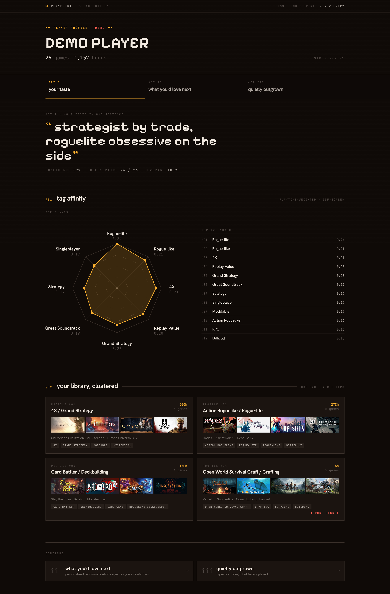
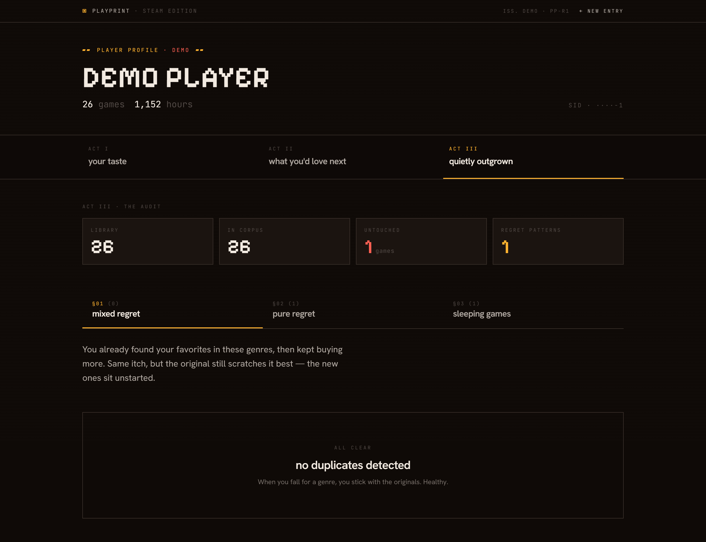

# Playprint

> **A Steam taste lens, not another Steam recommender.**
> Reads your library the way an editor reads a magazine archive — finds the shape of your taste, surfaces the games you'd actually love, and quietly points out the ones you bought but never started.

**Live**: [playprint](https://steam-taste.vercel.app) · **API**: [docs](https://steam-taste.onrender.com/docs)

> ⏳ The backend lives on Render's free tier — first request after idle takes ~30s while the dyno warms up. Subsequent requests are instant.

<p align="center">
  
</p>

---

## What it does

Drop in a SteamID (or click the demo) and Playprint reads your library across three acts:

| Act | What you see | What's actually happening |
|---|---|---|
| **I — your taste** | Pixel-art hero quote, 8-axis tag radar, clustered library cards | TF-IDF tag affinity + HDBSCAN library clustering |
| **II — what you'd love next** | Recommendation cards with "BECAUSE OF" attribution and "↳ closest fit" hint | Playtime-weighted taste vector × corpus, with closed-form per-game attribution |
| **III — quietly outgrown** | "Pure regret" / "mixed regret" / sleeping-games audit | Cluster-level diagnosis of low-playtime patterns |

The whole result page is built as a 3-act editorial spread, not a dashboard — Pixelify Sans on hero, Hanken Grotesk on body, amber on near-black.

---

## Why it exists

Steam's official recommender is excellent at what it's built for: maximizing conversion. Playprint deliberately does the things Steam **won't**:

| | Steam | Playprint |
|---|---|---|
| Optimization target | conversion (buy more) | fit (buy right) |
| Bias | popular & high-grossing | long tail & on-target |
| Explanations | black box | every rec carries shared tags + library evidence |
| Reverse advice | never | yes — "you don't actually finish this genre" |
| Self-reflection | absent | central feature (regret detector) |

Not trying to beat Steam on raw accuracy. Differentiation is in **what we choose to surface** and **how transparently**.

---

## The empirical method-selection story

Picking similarity methods was done as an honest ablation, not by vibes. The repo carries the receipts.

### Phase 0 — six-way game-similarity ablation

Compared TF-IDF / tag Jaccard / Steam genre overlap / sentence-transformer embeddings / hybrid blends on a 180-game hand-clustered probe set (8 dense clusters × ~22 games each).

| Method | Merged top-K hit rate |
|---|---|
| Tag Jaccard | **85%** |
| TF-IDF tag cosine | 83% |
| Sentence-transformer (description) | 55% |

The 30-point gap is the marketing copy in store descriptions polluting the semantic signal. The user-submitted SteamSpy tags are already a curated semantic compression — there's nothing left to distill with a transformer.

**Decision**: tag-based main path, no torch in runtime, deployment image dropped from ~1.5 GB to <200 MB.

### Phase 4 / 4+ — self-trained retrieval ablation

Two self-trained methods on top of the TF-IDF baseline, evaluated on a held-out probe of 75 games across 8 clusters (script: [`scripts/phase4plus_compare.py`](scripts/phase4plus_compare.py)):

| Method | Merged top-5 hit rate | Δ vs TF-IDF | Production |
|---|---|---|---|
| TF-IDF baseline | 83.2% | — | `/api/game/similar?method=tfidf` |
| **PPMI + SVD tag embedding** (Phase 4) | **85.6%** | **+2.4 pp** | `/api/game/similar?method=ppmi` ✅ |
| InfoNCE-trained dual encoder (Phase 4+) | 81.1% | −2.1 pp (within ±5.1 pp 95% CI) | `/api/game/similar?method=trained` (kept for comparison) |

The PPMI + SVD layer is the clean win — synonyms collapse (`Rogue-like` ↔ `Rogue-lite` ↔ `Action Roguelike` cosine ≈ 0.85-0.96) and per-cluster breakdown shows strong lifts where the tag vocabulary is fragmented (cozy_life_sim +15.6 pp, narrative +20.0 pp).

The InfoNCE-trained dual encoder, however, **did not separate from the matrix-factorization baseline** at this sample size. The −2.1 pp delta is within the probe's 95% confidence interval (±5.1 pp), so the honest reading is "matches baseline within noise" — not "loses." That's still the negative result for the deep-learning hypothesis on this corpus, and it lines up with Levy & Goldberg (2014): word2vec ≈ SPPMI matrix factorization, and on ~5k games with curated user tags as input, contrastive learning has nothing extra to find.

**That null result is in the repo on purpose.** It's the honest answer to "did you try deep learning?" and a better portfolio signal than a faked SOTA claim.

Both training scripts in [`scripts/`](scripts/) — PPMI is ~100 lines of numpy, the InfoNCE encoder is [`phase4plus_train.py`](scripts/phase4plus_train.py).

---

## Recommendation attribution — the closed-form decomposition

Every rec card shows **why** it was picked. The "why" used to be naïvely `overlap × log(playtime)`, which let the user's highest-playtime broad-tag games (e.g. *Monster Hunter: World* at 353 h) dominate every explanation regardless of true relevance.

Now it's the **closed-form decomposition of the recommendation cosine itself**. Because the taste vector is the L2-normalized playtime-weighted sum of library rows, each candidate's match score decomposes exactly into per-library-game contributions:

```
contribution(g, cand) = log(1 + hours_g) × cosine(g_vec, cand_vec)
```

This is the precise share that game `g` contributed to the recommendation — same units the recommender itself used.

To handle the case where a broad high-playtime game still dominates by sheer weight, there's a **second slot**: `closest_match`, picked by pure cosine (no playtime weighting), surfaced only when distinct from the drivers and above a similarity floor. So if your taste is dominated by *Monster Hunter: World* but the recommendation is *Tales of Berseria*, you see:

```
BECAUSE OF  Monster Hunter: World 353h · ELDEN RING 243h
↳ CLOSEST FIT  Tales of Zestiria 25h
```

The volumetric driver and the on-target driver are both honestly disclosed. See [`backend/taste_engine.py:explain()`](backend/taste_engine.py).

---

## Library Regret — the feature Steam will never build

Runs HDBSCAN over the library's TF-IDF vectors (cosine distance), classifies each cluster:

- **Pure regret** — entire cluster is low-playtime: *"This genre isn't actually for you."*
- **Mixed regret** — cluster has one high-playtime favorite + a pile of 0 h purchases: *"You found your one. Stop buying the rest."*
- **Sleeping games** — owned games with <30 minutes total playtime, ≥30 days old

Real run on a 1095-game library: 62 clusters → 45 regret patterns → 311 sleeping games.

Steam will never ship this — fewer purchases is fewer purchases. Playprint does it because for the player it's more valuable than another "you might also like."

<p align="center">
  
</p>

---

## Architecture

```
                       ┌─────────────────────────────────────┐
   user's SteamID ───▶ │ Steam Web API: GetOwnedGames        │
                       └────────────┬────────────────────────┘
                                    ▼
       ┌──────────────────────────────────────────────────────────┐
       │ Layer 3: playtime-weighted user taste vector (tag space) │
       │   taste = Σ log(1+hours_g) · tfidf[g]   (L2-normalized)  │
       └──────────────────────────────────────────────────────────┘
                                    │
            ┌───────────────────────┼───────────────────────┐
            ▼                       ▼                       ▼
   ┌────────────────┐    ┌────────────────────┐   ┌────────────────────┐
   │ recommend()    │    │ HDBSCAN clustering │   │ explain()          │
   │   cosine(taste,│    │   on library vecs  │   │  closed-form share │
   │     corpus)    │    │   → regret detect  │   │  + closest_match   │
   └────────────────┘    └────────────────────┘   └────────────────────┘
            ▲                       ▲                       ▲
            └───────────────────────┼───────────────────────┘
                                    │
                  ┌─────────────────┴──────────────────┐
                  │ Layer 1-2 (offline, prebuilt):     │
                  │  TF-IDF (4985 × 437 sparse)        │
                  │  PPMI + SVD tag embedding (50 d)   │
                  │  trained dual encoder (256 d)      │
                  └────────────────────────────────────┘
```

**Multi-layer engine** (full design in [`steam-game-advisor-project.md`](steam-game-advisor-project.md) §6):

1. Tag inverted index + TF-IDF (`data/tfidf.npz`)
2. Game-game similarity (cosine, three backends selectable)
3. Playtime-weighted user taste vector
4. HDBSCAN library clustering for regret
5. Self-trained PPMI + SVD tag co-occurrence embedding
6. (Phase 5, not yet built) Bayesian taste posterior with confidence

---

## Tech stack

**Runtime**
- Backend: Python 3.11, FastAPI, Uvicorn, numpy / scipy.sparse / scikit-learn (HDBSCAN)
- Frontend: React 18, Vite 6, TypeScript, Tailwind v4, react-router-dom v6
- Storage: SQLite (`data/corpus.db`) + sparse npz + dense npy

**Offline-only**
- PyTorch (Phase 4+ dual-encoder training in [`scripts/phase4plus_train.py`](scripts/phase4plus_train.py); the runtime image does not depend on torch)

**Hosting**
- Frontend: Vercel (auto-deploys on `git push`)
- Backend: Render free tier (~30 s cold start)

**Deliberately not in stack**: sentence-transformers, LLMs, ITAD price feed. Each was tried, measured, and dropped — see [`steam-game-advisor-project.md`](steam-game-advisor-project.md) §13.

---

## Repository layout

```
backend/                FastAPI + taste engine + Steam OpenID
  taste_engine.py         core: TF-IDF, taste vector, recommend, explain
  regret_detector.py      HDBSCAN + pure / mixed / sleeping classification
  main.py                 API endpoints + CORS + lifespan
  steam_client.py         Steam Web API + SteamID resolution
frontend/               React + Vite + TS + Tailwind v4
  src/pages/Result.tsx    3-Act shell
  src/components/
    TagRadar.tsx          self-drawn SVG radar (no chart lib)
    TasteProfileTab.tsx   Act I
    RecommendationsTab.tsx Act II
    RegretTab.tsx         Act III
scripts/                Offline & evaluation
  phase1_*                corpus fetch + TF-IDF build
  phase4_*                PPMI + SVD tag embedding
  phase4plus_*            trained dual encoder + three-way ablation
  embedding_compare.py    Phase 0 six-way method comparison
data/                   Prebuilt artifacts (committed for fast deploys)
  corpus.db               4985 games + tags
  tfidf.npz               4985 × 437 sparse
  tag_embedding.npy       437 × 50 (PPMI + SVD)
  game_embedding.npy      4985 × 256 (trained dual encoder)
```

Full design doc: [`steam-game-advisor-project.md`](steam-game-advisor-project.md).
Operational handoff (env, gotchas, git history): [`HANDOFF.md`](HANDOFF.md).

---

## Local development

**Backend**
```powershell
py -m venv .venv
.venv\Scripts\activate
pip install -r requirements.txt
py -m uvicorn backend.main:app --reload --port 8000
```
API docs at http://localhost:8000/docs.

**Frontend**
```powershell
cd frontend
npm install
npm run dev          # http://localhost:5173
```

A `.env` with `STEAM_API_KEY=<your-32-hex-key>` is needed for live Steam lookups. Demo mode (`/result?demo=1`) works without one.

**End-to-end smoke (no frontend needed)**
```powershell
py scripts/phase2_test_engine.py                    # demo user pipeline
py scripts/phase4plus_compare.py                    # three-way retrieval ablation
```

**Rebuilding the corpus** (only if you want to refresh from Steam — takes ~2 hours):
```powershell
py scripts/phase1_fetch_corpus.py
py scripts/phase1_build_index.py
py scripts/phase4_build_tag_embedding.py
```

---

## Status & roadmap

- ✅ Phases 0 – 4+ shipped, plus the editorial UI rebrand and the closed-form attribution rewrite
- ⏳ Phase 5: Bayesian taste posterior + 5-way multi-query similarity (`similar_but_slower`, `similar_but_chill`, etc.)
- ⏳ Render cold-start mitigation (uptime ping / front-page warm-up)

See [`HANDOFF.md`](HANDOFF.md) §10 for the full prioritized roadmap.

---

## Acknowledgments

- Empirical decision to drop transformer embeddings: [Phase 0 probe](scripts/embedding_compare.py)
- Theoretical backstop for "trained encoder didn't beat baseline": Levy & Goldberg, *Neural Word Embedding as Implicit Matrix Factorization* (NeurIPS 2014)
- Game metadata + user tags: [Steam Store API](https://store.steampowered.com/) + [SteamSpy](https://steamspy.com/)

Built solo as a portfolio piece — the goal was to ship a real product, run real experiments, and write the negative results down.
